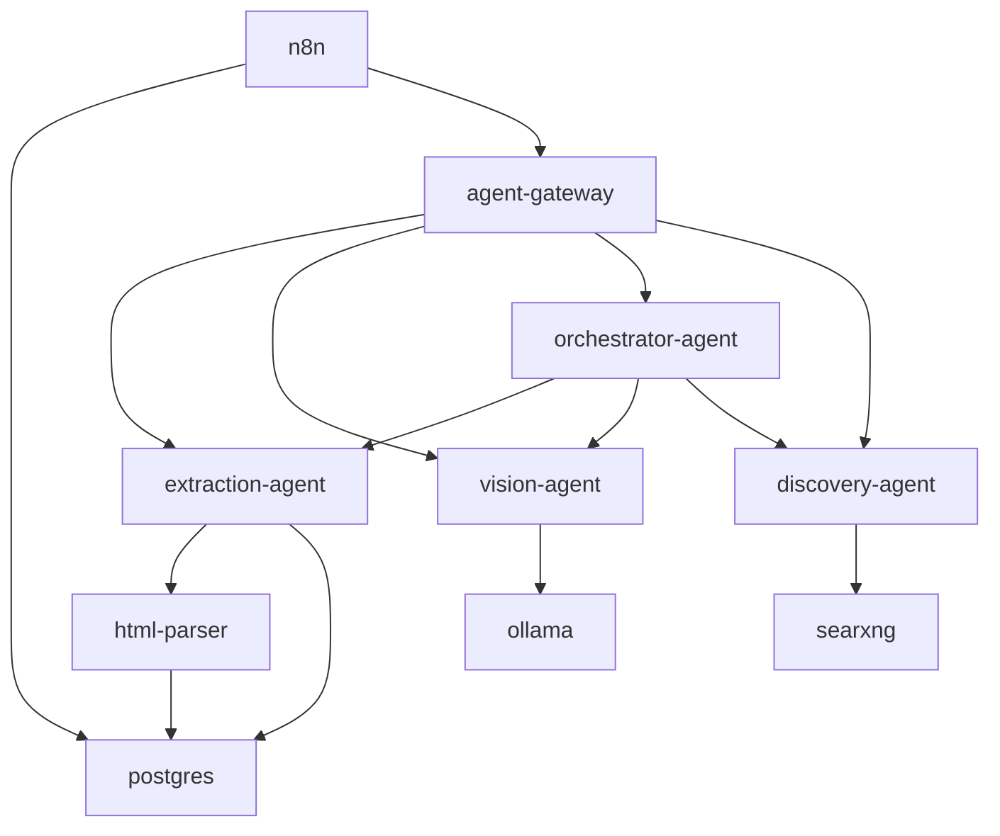

# Services Documentation

Complete documentation of all services in the prompt2dataset MVP stack.

## Table of Contents

1. [Architecture Overview](#architecture-overview)
2. [Service Catalog](#service-catalog)
3. [Service Dependencies](#service-dependencies)
4. [Service Details](#service-details)

---

## Architecture Overview

The MVP stack is organized into 5 layers:

```
┌─────────────────────────────────────┐
│         Agent Gateway               │  ← Entry point (port 8000)
│         (API Gateway)               │
└─────────────────────────────────────┘
              ↓
┌─────────────────────────────────────┐
│         Agent Layer                 │
│  Extraction | Vision |              │
│  Orchestrator | Discovery           │
└─────────────────────────────────────┘
              ↓
┌─────────────────────────────────────┐
│      Utility Layer                  │
│  HTML Parser | Camoufox             │
└─────────────────────────────────────┘
              ↓
┌─────────────────────────────────────┐
│      Data Layer                     │
│  PostgreSQL + pgvector              │
└─────────────────────────────────────┘
              ↓
┌─────────────────────────────────────┐
│      External Services              │
│  Ollama | SearxNG | n8n             │
└─────────────────────────────────────┘
```

---

## Service Catalog

| Service | Type | Port | Status | Purpose |
|---------|------|------|--------|---------|
| **postgres** | Database | 5432 | Running | PostgreSQL with pgvector |
| **ollama** | LLM | 11434 | Pending | Local LLM inference |
| **camoufox** | Scraper | 3000 | Pending | Browser automation |
| **html-parser** | Utility | 5000 | Pending | HTML parsing service |
| **searxng** | Search | 8888 | Running | Privacy-focused search |
| **n8n** | Orchestration | 5678 | Running | Workflow automation |
| **extraction-agent** | Agent | 8001 | Pending | Data extraction |
| **vision-agent** | Agent | 8002 | Pending | Image analysis |
| **orchestrator-agent** | Agent | 8003 | Pending | Workflow coordination |
| **discovery-agent** | Agent | 8004 | Pending | Service discovery |
| **agent-gateway** | Gateway | 8000 | Running | API gateway |

---

## Service Dependencies



---

## Service Details

### 1. PostgreSQL (postgres)

**Purpose**: Primary database with vector search capabilities

**Image**: `pgvector/pgvector:pg16`

**Port**: 5432

**Environment Variables**:
- `POSTGRES_USER`: postgres
- `POSTGRES_PASSWORD`: ${DB_PASSWORD}
- `POSTGRES_DB`: app_db

**Health Check**: `pg_isready -U postgres`

**Data Storage**:
- Volume: `postgres_data:/var/lib/postgresql/data`
- Persistent storage for all agent data

**Used By**:
- extraction-agent
- html-parser
- n8n

**Configuration**:
```sql
-- pgvector extension for embeddings
CREATE EXTENSION IF NOT EXISTS vector;

-- Example usage
CREATE TABLE embeddings (
  id SERIAL PRIMARY KEY,
  content TEXT,
  embedding vector(1536)
);
```

---

### 2. Ollama (ollama)

**Purpose**: Local LLM inference for text and vision

**Image**: `ollama/ollama:latest`

**Port**: 11434

**Environment Variables**:
- `OLLAMA_HOST`: 0.0.0.0:11434

**Models**:
- `mistral:latest`: General-purpose LLM
- `llava:latest`: Vision-language model
- `neural-chat:latest`: Conversational AI
- `qwen:14b`: Advanced reasoning

**Health Check**: `curl -f http://localhost:11434/api/tags`

**Data Storage**:
- Volume: `ollama_data:/root/.ollama`
- ~10-15GB per model

**API Endpoints**:
- `GET /api/tags`: List models
- `POST /api/generate`: Generate text
- `POST /api/chat`: Chat completion

**Used By**:
- vision-agent

---

### 3. Camoufox (camoufox)

**Purpose**: Stealth browser automation for web scraping

**Image**: `camoufox/camoufox:latest`

**Port**: 3000

**Environment Variables**:
- `HEADLESS`: true

**Features**:
- Anti-detection browser
- JavaScript rendering
- Screenshot capture
- Cookie management

**Health Check**: `curl -f http://localhost:3000/health`

**Used By**:
- Future: extraction-agent (for dynamic content)

---

### 4. HTML Parser (html-parser)

**Purpose**: Parse and extract structured data from HTML

**Port**: 5000

**Build**: `services/html-parser/`

**Dependencies**:
- BeautifulSoup4
- lxml
- html5lib

**API Endpoints**:
- `GET /health`: Health check
- `POST /parse`: Parse HTML → structured data
- `POST /extract`: Extract clean text

**Response Format**:
```json
{
  "title": "Page Title",
  "headings": {"h1": [...], "h2": [...]},
  "links": [{"text": "...", "href": "..."}],
  "images": [{"alt": "...", "src": "..."}],
  "paragraphs": ["..."],
  "meta": {"description": "..."}
}
```

**Used By**:
- extraction-agent

---

### 5. SearxNG (searxng)

**Purpose**: Privacy-focused meta-search engine

**Image**: `searxng/searxng:latest`

**Port**: 8888

**Environment Variables**:
- `BASE_URL`: Search base URL

**Features**:
- Aggregates results from multiple search engines
- No tracking, no ads
- JSON API support

**API Endpoints**:
- `GET /search?q=query&format=json`: Search

**Used By**:
- discovery-agent

---

### 6. n8n (n8n)

**Purpose**: Workflow automation and orchestration

**Image**: `n8nio/n8n:latest`

**Port**: 5678

**Environment Variables**:
- `DB_TYPE`: postgresdb
- `DB_HOST`: postgres
- `N8N_SECURE_COOKIE`: false

**Features**:
- Visual workflow builder
- 300+ integrations
- Webhooks and API triggers
- Cron scheduling

**Use Cases**:
- Scheduled data extraction
- Pipeline automation
- Event-driven workflows

**Sample Workflows**: See `n8n-workflows/examples/`

---

### 7. Extraction Agent (extraction-agent)

**Purpose**: Extract and process data from web pages

**Port**: 8001

**Build**: `services/extraction-agent/`

**API Endpoints**:
- `GET /health`: Health check
- `POST /extract`: Extract data from URL/HTML
- `GET /extractions`: List recent extractions

**Request Format**:
```json
{
  "url": "https://example.com",
  "type": "full" | "links" | "text"
}
```

**Workflow**:
1. Fetch URL content
2. Send to html-parser for parsing
3. Extract structured data
4. Store in database
5. Return results

**Dependencies**:
- html-parser
- postgres

---

### 8. Vision Agent (vision-agent)

**Purpose**: Analyze images using vision-language models

**Port**: 8002

**Build**: `services/vision-agent/`

**API Endpoints**:
- `GET /health`: Health check
- `POST /analyze`: Analyze image
- `POST /extract-text`: OCR from image
- `GET /models`: List vision models

**Request Format**:
```json
{
  "image_url": "https://example.com/image.jpg",
  "prompt": "Describe this image",
  "model": "llava:latest"
}
```

**Capabilities**:
- Image description
- Object detection (via LLM)
- OCR/text extraction
- Visual question answering

**Dependencies**:
- ollama

---

### 9. Orchestrator Agent (orchestrator-agent)

**Purpose**: Coordinate complex multi-agent workflows

**Port**: 8003

**Build**: `services/orchestrator-agent/`

**API Endpoints**:
- `GET /health`: Health check
- `POST /orchestrate`: Run workflow

**Workflows**:

1. **extract-and-analyze**:
   - Extract page content
   - Analyze images found on page
   
2. **discover-and-extract**:
   - Discover related URLs
   - Extract from discovered pages
   
3. **full-analysis**:
   - Combine extraction + discovery + vision
   - Parallel processing

**Request Format**:
```json
{
  "workflow": "full-analysis",
  "url": "https://example.com",
  "query": "machine learning"
}
```

**Dependencies**:
- extraction-agent
- vision-agent
- discovery-agent

---

### 10. Discovery Agent (discovery-agent)

**Purpose**: Discover content and monitor services

**Port**: 8004

**Build**: `services/discovery-agent/`

**API Endpoints**:
- `GET /health`: Health check
- `POST /discover`: Discover related content
- `GET /services`: List all services
- `GET /services/status`: Check service health
- `POST /extract-links`: Extract links from page

**Features**:
- Search integration (SearxNG)
- Service registry monitoring
- Link extraction and discovery

**Request Format**:
```json
{
  "query": "machine learning",
  "source_url": "https://example.com",
  "limit": 10
}
```

**Dependencies**:
- searxng
- services.json

---

### 11. Agent Gateway (agent-gateway)

**Purpose**: Unified API gateway for all services

**Port**: 8000

**Build**: `services/agent-gateway/`

**API Endpoints**:
- `GET /`: Service info
- `GET /health`: Gateway health
- `POST /api/extract`: Route to extraction-agent
- `POST /api/analyze-image`: Route to vision-agent
- `POST /api/orchestrate`: Route to orchestrator-agent
- `POST /api/discover`: Route to discovery-agent
- `GET /api/services`: List services
- `GET /api/services/status`: Service status
- `POST /api/pipeline`: Run complete pipeline

**Features**:
- CORS enabled
- Centralized routing
- Error handling
- Request/response logging

**Pipeline Workflow**:
```
Client → Gateway → Agents → Gateway → Client
```

**Dependencies**:
- All agents

---

## Service Communication

### Internal Network

All services communicate via Docker network (`mvp-network`):

```
http://postgres:5432
http://ollama:11434
http://html-parser:5000
http://extraction-agent:8001
http://vision-agent:8002
http://orchestrator-agent:8003
http://discovery-agent:8004
http://agent-gateway:8000
```

### External Access

Only these services need external access:
- **agent-gateway** (8000): Public API
- **n8n** (5678): Workflow management UI
- **searxng** (8888): Optional public search

---

## Performance Characteristics

| Service | Avg Response Time | Resource Usage | Scalable |
|---------|------------------|----------------|----------|
| postgres | 5-10ms | Medium | Yes (replicas) |
| ollama | 1-5s | High (GPU) | Limited |
| html-parser | 100-500ms | Low | Yes |
| extraction-agent | 1-3s | Medium | Yes |
| vision-agent | 2-10s | High | Limited |
| orchestrator-agent | 5-30s | Medium | Yes |
| discovery-agent | 500ms-2s | Low | Yes |
| agent-gateway | 50-100ms | Low | Yes |

---

## Monitoring

### Health Checks

All services expose `/health` endpoint:

```bash
# Check all services
python scripts/service_tracker.py --detailed

# Watch continuously
python scripts/service_tracker.py --watch --interval 10
```

### Logs

```bash
# View all logs
docker-compose logs -f

# View specific service
docker-compose logs -f extraction-agent

# Follow last 100 lines
docker-compose logs -f --tail=100
```

### Metrics

Key metrics to monitor:
- Response times
- Error rates
- Queue depths
- Resource usage (CPU, memory, disk)
- Model inference times (Ollama)

---

## Maintenance

### Updates

```bash
# Pull latest images
docker-compose pull

# Rebuild custom images
docker-compose build --no-cache

# Restart services
docker-compose down
docker-compose up -d
```

### Database Maintenance

```bash
# Vacuum database
docker exec postgres vacuumdb -U postgres -d app_db -v

# Backup
docker exec postgres pg_dump -U postgres app_db > backup.sql

# Restore
docker exec -i postgres psql -U postgres app_db < backup.sql
```

### Model Management

```bash
# List Ollama models
docker exec ollama ollama list

# Pull new model
docker exec ollama ollama pull codellama:latest

# Remove unused model
docker exec ollama ollama rm old-model:tag
```

---

## Development Tips

### Local Testing

```bash
# Start minimal stack
docker-compose up -d postgres html-parser

# Test individual service
cd services/extraction-agent
python app.py

# Use client SDK
python scripts/service_client.py --extract "https://example.com"
```

### Adding New Services

1. Create service directory in `services/`
2. Add Dockerfile, requirements.txt, app.py
3. Update `services.json`
4. Update `coolify-manifest.yaml`
5. Update `docker-compose.local.yml`
6. Document in this file

### Service Template

See any existing service for template structure:
- Flask app with health endpoint
- Docker multi-stage build
- Environment configuration
- Error handling and logging
